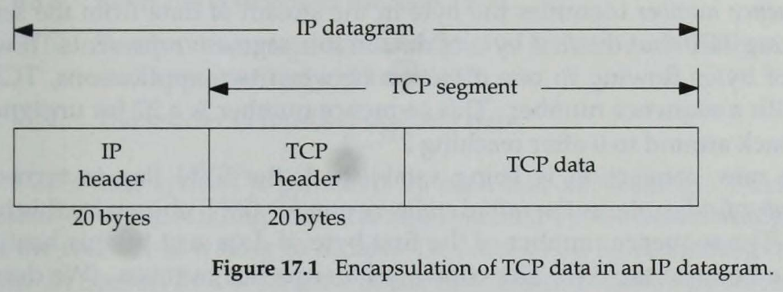

# Chapter 17 TCP: Transmission Control Protocol

## 17.1 Introduction

We look at the fields in the TCP header. In the chapters that follow we examine all of these header fields in more detail, as we see how TCP operates.

**chapter 18: TCP connection, including connection establish and terminate**

**chapter 19-20: normal transfer of data, both for interactive use (remote login) and bulk data (file transfer)**

**chapter 21: TCP timeout and retransmission**

**chapter 22-23: TCP timer**

**chapter 24: newer TCP features and TCP performance**

## 17.2 TCP Services

TCP provides a **connection-oriented, reliable, byte stream** service.

The term *connection-oriented* means the two application s using TCP (normally considered a client and a server) must establish a TCP connection with each other before they exchange data.

There are **exactly two end points** communicating with each other on a TCP connection. Concepts that we talked about in Chapter 12, **broadcasting and multicasting, aren't applicable to TCP**.

**TCP provides reliability by doing the following**:

- The **application data is broken into what TCP considers the best sized chunks to send**. This is totally different from UDP, which each write by the application generates UDP datagram of that size. The unit of information passed by TCP to IP is called a **segment**
- When TCP sends a segment it **maintains a timer**, **waiting for the other end to acknowledge** of the segment. if an acknowledgement isn't received in time, the segment is retransmitted. (sender)
- When TCP receives data from the other end of the connection, it **sends an acknowledgement**. This acknowledgement is **not sent immediately**, but normally delayed a fraction of a second. (receiver)
- TCP **maintains a checksum on its header and data**. This an end-to-end checksum whose purpose is to detect any modification of the data in transit. If a segment arrives with an invalid checksum, TCP discards it and doesn't acknowledge receiving it.(It expects the sender to time out and retransmit)
- Since TCP segments are transmitted as IP datagrams, and since IP datagrams can arrive out of order, TCP segments can arrive out of order. A receiving TCP resequences the data if necessary, **passing the received data in the correct order to the application**.
- Since IP datagrams can get duplicated, a receiving TCP must **discard the duplicate data**.
- TCP also provides **flow control**. **Each end** of a TCP connection has a finite amount of buffer space. **A receiving TCP only allows the other end to send as much data as the receiver has buffers for**. This prevents a fast host from taking all the buffers on a slower host

A stream of 8-bit bytes is exchanges across the TCP connection between the two applications.**There are no record markers automatically inserted by TCP**. This is what we called a *byte stream service*. If an application on one end writes 10 bytes, followed by a write of 20 bytes, followed by a write of 50 bytes, the application at the other end of the connection can not tell what size the individual writes were.The other end may read 80 bytes in four reads of 20 bytes at a time. **One end puts a stream of bytes into TCP and the same, identical stream of bytes appears at the other end**.

Also, TCP does not interpret the contents of the bytes at all. **TCP has no idea if the data bytes being exchanged are binary data, ASCII characters, EBCDIC characters, or whatever**. The interpretation of this byte stream is up to the applications on each end of the connection.

This treatment of the byte stream by TCP is similar to the treatment of a file by the Unix operating system. The Unix kernel does no interpretation whatsoever of the bytes that an application reads or write--that is up to the applications. There is no distinction to the Unix kernel between a binary file or a file containing lines of text.

## 17.3 TCP Header

TCP data is encapsulated in an IP datagram, as shown in following:

**Normal size of the TCP header is 20 bytes, unless options are present**.

**port number**

source and destination port number identify the sending and receiving application, along with the source and destination IP address in the IP header uniquely identify each connection.

**The combination of an IP addres and a port number is sometimes called a *socket* **. It is the *socket paire* (the 4-tuple consisting of the client IP address, client port number, server IP address, server port number) that specifies the two end points that uniquely identifies each TCP connection in an internet.

**sequence number**

